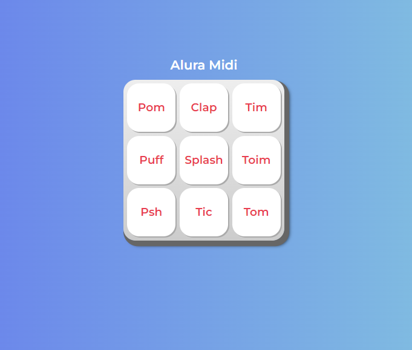

<h1 align="center"> PROYECTO ALURA MIDI </h1>

<h1 align="center"> Front End G6 - ONE </h1>
 
# Curso de JavaScript para Web: Crea páginas dinámicas 

👩‍💻 💻 Desarrollo del proyecto Alura Midi: "Instrumento Musical "   

El proyecto del curso es el Alura Midi que es un instrumento musical de interfaz 
digital al cual le agregaremos las funcionalidades en el transcurso del curso.
En el aprendimos a hacer una serie de funciones iniciales con JavaScript.
Creamos una función que reproduce el sonido de instrumentos musicales que están 
almacenados dentro de un elemento de audio HTML.
Hicimos que nuestros botones funcionaran y reprodujeran el sonido del instrumento que queremos.
También trabajamos la accesibilidad con la navegación vía teclado, agregando un destaque rojo 
a los botones cuando son accionados utilizando la tecla "Enter" o la barra de espacio desde 
el teclado de la computadora. 
Aprendimos cómo crear un código optimizado, reduciendo las repeticiones de código y 
facilitando, así, su mantenimiento.

     

 
  ❤️ ESTADO: Finalizado
 

## 🔎 Deploy

  <h3>
    <a href="https://bety2022.github.io/AluraMidi/" >
      🔗 Visitar la Plataforma del Instrumento Musical de Alura Midi
    </a>

 

## 🛠️ Herramientas implementadas 
  - Layouts
  - Flexbox
  - CSS
  - HTML
  - JavaScript
  - Git || GitHub || GitHub Pages

    

 

 

## 📧 Contacto
¿Tienes un proyecto en mente? Conectémonos y hagamos que las cosas sucedan! Puedes escribirme a carolinalopezdatascientist@gmail.com o seguirme en [LinkedIn](https://www.linkedin.com/in/carolina-lopez-430208106/).
  
